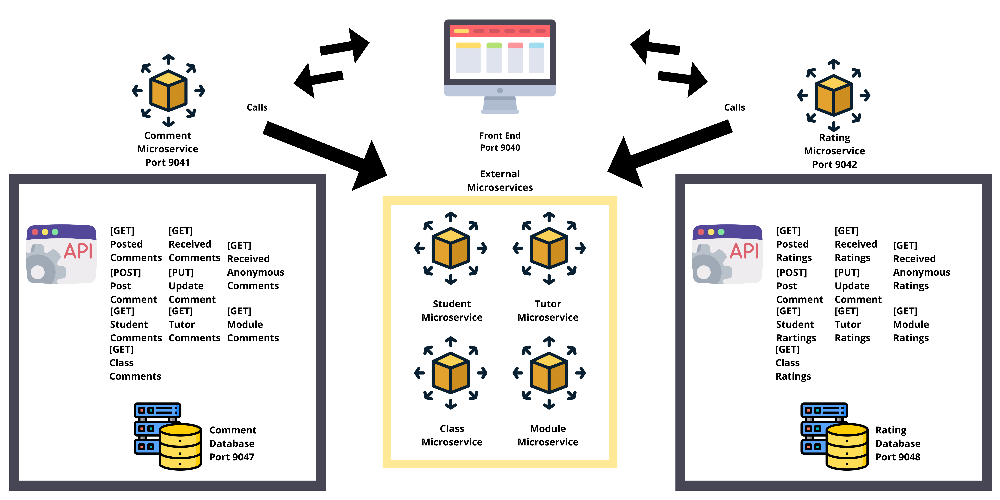

# ETIAssignment2
## API Endpoints:
| Microservice  | Port | Endpoint URL |
| ------------- | ---- | ------------ |
| Frontend  | 9040 | http://10.31.11.12:9040 |
| Comment API  | 9091 | http://10.31.11.12:9041 |
| Rating API  | 9092 | http://10.31.11.12:9042 |

## Design Considerations

Following the Microservice ideology, having a loosely coupled system would mean that functional components should be seperated and be able to run independently of each other.
In the EDUFI Application, there are a total of 23 packages, all split into different functionalities.
My package is in charge of the Comments and Ratings for Students.
They will be able to view comments and ratings for other Students, Tutors, Modules and Classes respectively.
They are also able to create such comments and ratings, if they are logged in.
They are able to view all comments and ratings received, seperated by anonymous and all.
Finally they are also able to view their posted comments and ratings.

My package consists of 3 different microservices, and are in charge of all things related to ratings and comments for the EDUFI application.
The 3 Microservices - Comment Rating both run independently, and has its own database which contains the Comment Table and Rating Table respectively, while the Front End microserice which takes care of the front end pages, use apache webhosting to render the pages. If the comment microservice were to suddenly stop functioning, the Rating microservice will be fully functional following the loosely coupled ideology and practice of Mircoservices.

My package and microservices rely on 5 other microservices to run.
1. Student Microservice
2. Tutor Microservice
3. Class Microservice
4. Module Microservice

From these Microservices, the different objects can be retrieved, and thus linked to the comments/ratings stored in my microservices as either the creator, or target of the Comment/Rating.

## Front End
Front End calls to the backend APIs are through AJAX, where the resulting successful response will be in jsonstring, which can be used through javascript to be displayed through html code for the user to see on the webpage.
Bootstrap was used for the simplicity of styling the frontend pages.

## Backend
MySQL was used for the databases purely out of simplicity. It is not the lightest framework to use, however it is widely supported throughout the industry, and I am most comfortable with it.

**Docker Hub Links**

- [Ratings Microservice](https://hub.docker.com/repository/docker/ethanhaseaten/etiassignment2ratingdb)
- [Ratings Database](https://hub.docker.com/repository/docker/ethanhaseaten/etiassignment2ratingdb)
- [Comments Microservice](https://hub.docker.com/repository/docker/ethanhaseaten/commentcontainer)
- [Comments Database](https://hub.docker.com/repository/docker/ethanhaseaten/etiassignment2commentdb)
- [Frontend](https://hub.docker.com/repository/docker/ethanhaseaten/frontendcontainer)


## Front End Webpage Routes
```sh
# 1. Comments and Ratings Dashboard
# (Comments and Ratings be posted and seen by first selecting target through this page)
http://10.31.11.12:9040/Main/dashboard.html

# 2. Specific student feedback
http://10.31.11.12:9040/Main/dashboard

# 3. Personal posted and received ratings
http://10.31.11.12:9040/Main/ratings

# 4. Personal posted and received comments
http://10.31.11.12:9040/Main/comments

```

## Documentation

### Comment Data Structure
| Attribute | Data Type |
| --------- | ---- |
| CommentID | uint |
| CreatorType | varchar(255) |
| CreatorID | varchar(9) |
| TargetType | varchar(255) |
| TargetID | varchar(9) |
| CommentData | varchar(500) |
| Anonymous | bool |
| DateTimePublished | datetime |

### Rating Data Structure
| Attribute | Data Type |
| --------- | ---- |
| RatingID | uint |
| CreatorType | varchar(255) |
| CreatorID | varchar(9) |
| TargetType | varchar(255) |
| TargetID | varchar(9) |
| RatingScore | varchar(500) |
| Anonymous | bool |
| DateTimePublished | datetime |

# Comment Microservice API Documentation
### [GET] /api/comment/{id}
Get comment by CommentID
```

Endpoint
http://10.31.11.12:9041/api/comment/{id}
Response
Status code 200 if successful, else an error code with a corresponding status message will be returned if unsuccessful. 
```

### [PUT] /api/comment/{id}
Update comment by CommentID
```
Endpoint:
http://10.31.11.12:9041/api/comment/{id}
Response:
Status code 200 if successful, else an error code with a corresponding status message will be returned if unsuccessful. 
```

### [POST] /api/comment
Create Comment
```
Endpoint:
http://10.31.11.12:9041/api/comment
Response:
Status code 201 if successful, else an error code with a corresponding status message will be returned if unsuccessful. 
```


### [GET] /api/comment/received/{type}/{id}
Get received comments by user type and id
```
Endpoint:
http://10.31.11.12:9041/api/comment/received/{type}/{id}
Response:
Status code 200 if successful, else an error code with a corresponding status message will be returned if unsuccessful. 
```

### [GET] /api/comment/received/anonymous/{type}/{id}
Get received anonymous comments by user type and id
```
Endpoint:
http://10.31.11.12:9041/api/comment/received/anonymous/{type}/{id}
Response:
Status code 200 if successful, else an error code with a corresponding status message will be returned if unsuccessful. 
```

### [GET] /api/comment/posted/{type}/{id}
Get user's posted comments
```
Endpoint:
http://10.31.11.12:9041/api/comment/posted/{type}/{id}
Response:
Status code 200 if successful, else an error code with a corresponding status message will be returned if unsuccessful. 
```

### [GET] /api/comment/student/{id}
### [GET] /api/comment/tutor/{id}
### [GET] /api/comment/class/{id}
### [GET] /api/comment/module/{id}
Get comments for all students, tutor, classes or modules.
```
Endpoint:
http://10.31.11.12:9041/api/comment/student/{id}<br />
http://10.31.11.12:9041/api/comment/tutor/{id}<br />
http://10.31.11.12:9041/api/comment/class/{id}<br />
http://10.31.11.12:9041/api/comment/module/{id}<br />
Response:
Status code 200 if successful, else an error code with a corresponding status message will be returned if unsuccessful. 
```

## Sample of Comment jsonstring returned for GET request:
```
{
  "CommentID":1,
  "CreatorID":"1",
  "CreatorType":"Student",
  "TargetID":"2",
  "TargetType":"Student",
  "CommentData":"Great at working in teams.",
  "Anonymous":0,
  "DateTimePublished":"2022-02-04 04:14:06",
  "CreatorName":"Ethan",
  "TargetName":"Test"
 }
```

# Rating Microservice API Documentation

### [GET] /api/rating/{id}
Get Rating by RatingID
```
Endpoint:
http://10.31.11.12:9042/api/rating/{id}
Response:
Status code 200 if successful, else an error code with a corresponding status message will be returned if unsuccessful. 
```


### [PUT] /api/rating/{id}
Update Rating 
```
Endpoint
http://10.31.11.12:9042/api/rating/{id}
Response
Status code 200 if successful, else an error code with a corresponding status message will be returned if unsuccessful. 
```

### [POST] /api/rating/create
Create Rating
```
Endpoint:
http://10.31.11.12:9042/api/rating/create
Response:
Status code 201 if successful, else an error code with a corresponding status message will be returned if unsuccessful. 
```


### [GET] /api/rating/received/{type}/{id}
Get received ratings by user type and id
```
Endpoint:
http://10.31.11.12:9042/api/rating/received/{type}/{id}
Response:
Status code 200 if successful, else an error code with a corresponding status message will be returned if unsuccessful. 
```

### [GET] /api/rating/received/anonymous/{type}/{id}
Get received anonymous ratings by user type and id
```
Endpoint:
http://10.31.11.12:9042/api/rating/received/anonymous/{type}/{id}
Response:
Status code 200 if successful, else an error code with a corresponding status message will be returned if unsuccessful. 
```

### [GET] /api/rating/posted/{type}/{id}
Get poasted ratings by user type and id
```
Endpoint:
http://10.31.11.12:9042/api/rating/posted/{type}/{id}
Response:
Status code 200 if successful, else an error code with a corresponding status message will be returned if unsuccessful. 
```

### [GET] /api/rating/student/{id}
### [GET] /api/rating/tutor/{id}
### [GET] /api/rating/class/{id}
### [GET] /api/rating/module/{id}
Get ratings for all students, tutor, classes or modules.
```
Endpoint:
http://10.31.11.12:9042/api/rating/student/{id}<br />
http://10.31.11.12:9042/api/rating/tutor/{id}<br />
http://10.31.11.12:9042/api/rating/class/{id}<br />
http://10.31.11.12:9042/api/rating/module/{id}<br />
Response:
Status code 200 if successful, else an error code with a corresponding status message will be returned if unsuccessful. 
```

## Sample of Rating jsonstring returned for GET request:
```
{"RatingID":1,
"CreatorID":"2",
"CreatorType":"Student",
"TargetID":"1",
"TargetType":"Student",
"RatingScore":3,
"Anonymous":1,
"DateTimePublished":"2022-02-04 04:14:06",
"CreatorName":"Kester",
"TargetName":"Ethan"}
```

